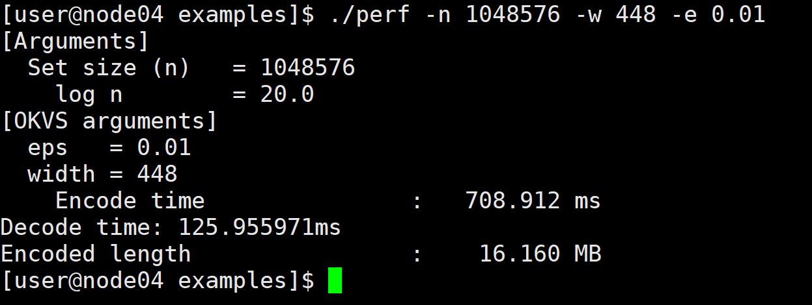

# Okvs

This library is basically based on [volepsi](https://github.com/Visa-Research/volepsi), and I would like to express my gratitude here.

### Build
okvsPSI
```
git clone https://github.com/ShallMate/okvsPSI
cd okvsPSI
python3 build.py -DVOLE_PSI_ENABLE_BOOST=ON
```
### Installing

```
python3 build.py --install
```
or 
```
python3 build.py --install=install/prefix/path
```

### Use
```
cd out/build/linux/okvspsi/
./okvspsi -nn 20 -v 
```

### Okvs Result example


